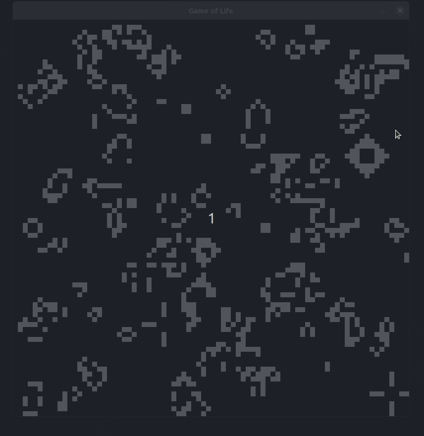
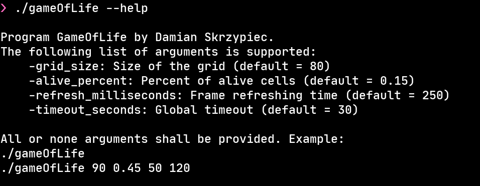

# Conway's Game of Life

## About
This repo contains C++ implementation of classic version of Conway's
Game of Life.
This micro project was about me testing `SDL2` C and C++ library for graphics.

Source code was written on Linux but it should be easily ported 
to other platforms where `SDL2` library exists. Besides this
dependency I've used only C++ standard library.



## Compilation

For compilation I've used C++17 (almost surely C++11 would be enough) and I've `SDL2` library installed. 
For Ubuntu one can easy install `SDL2` library using 

```
sudo apt install libsdl2-dev
```

Next you can use 

```
./compile
./gameOfLife
```

to compile the source code and run the game.

## Configuration

Most of the game parameters can be passed through command arguments.
Built-in help lists all of parameters:



## License
MIT.